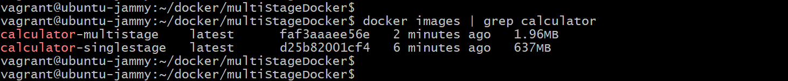

# MultiStage Docker Build and Distroless Images

This project demonstrates the advantages of using MultiStage Docker Build over SingleStage Docker Build by deploying a simple calculator application built in Golang. It also highlights the benefits of using Distroless images for security and efficiency. 

## Why MultiStage Docker Builds?

MultiStage Docker Build is used to minimize the size of Docker images and improve maintainability. By separating the build environment and runtime environment within a single Dockerfile, we can:
- Optimize the image size by including only the necessary runtime components.
- Keep the build environment isolated and clean.

## Why Distroless Images?

Distroless images contain only the essential components required for running an application. They do not include a package manager, shell, or any debugging utilities, making them lightweight and secure.

## Project Overview

This project showcases two different build methods to deploy a simple calculator Golang application:

## SingleStage Docker Build

## MultiStage Docker Build

It then compares the sizes of both image types to illustrate the benefits of a MultiStage Build.

## Building the Images

## SingleStage Build

- Clone the repo and switch to the singleStageDocker folder.
- Run the below command to build the image using Single stage Dockerfile.

    ```bash
    docker build -t calculator-singlestage .
    ```

## MultiStage Build

- Switch to the MultISTAGE_DOCKERFILE and Run the below command to build the image using Mutli stage Dockerfile.

    ```bash
    docker build -t calculator-multistage .
    ```

## Comparing Image Sizes

- Run the following command to check the size of the built images:

  ```bash
    docker images | grep calculator
    ```
- Notice the significant difference in image sizes between SingleStage and MultiStage builds.

<div align="center">
  
</div>
